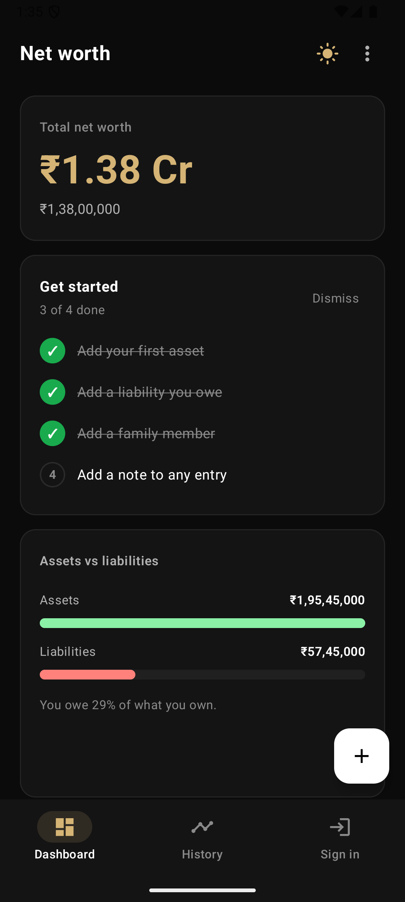
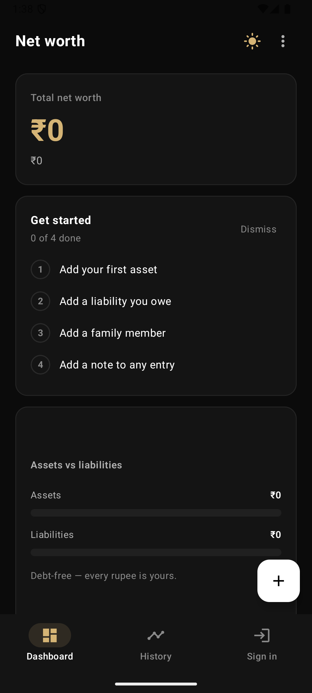
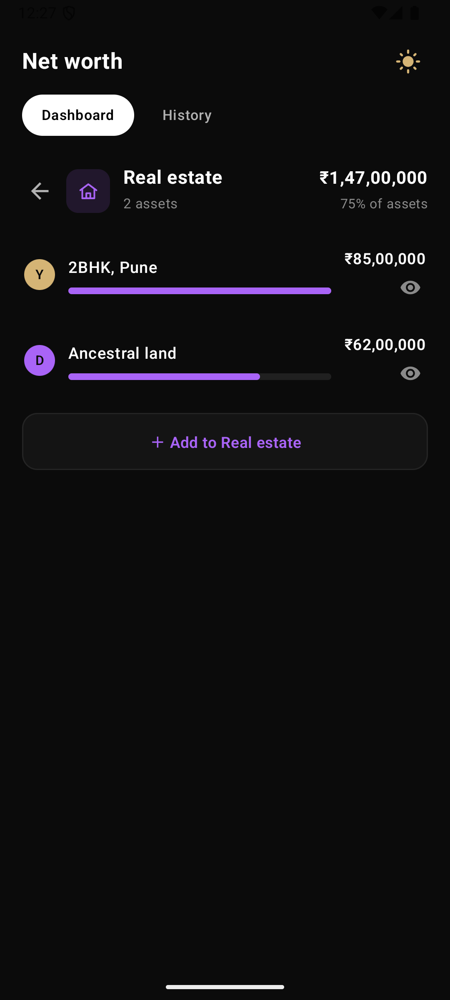
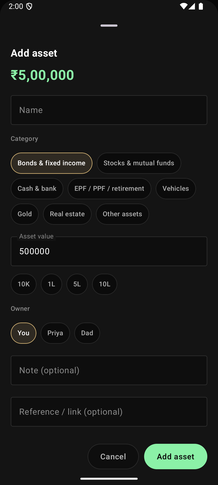
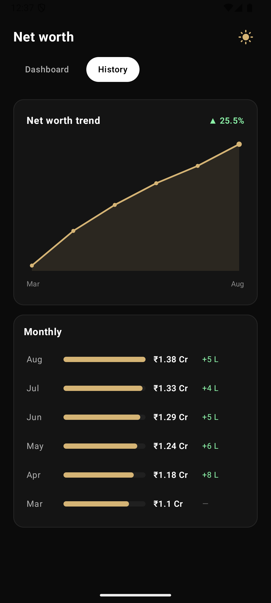
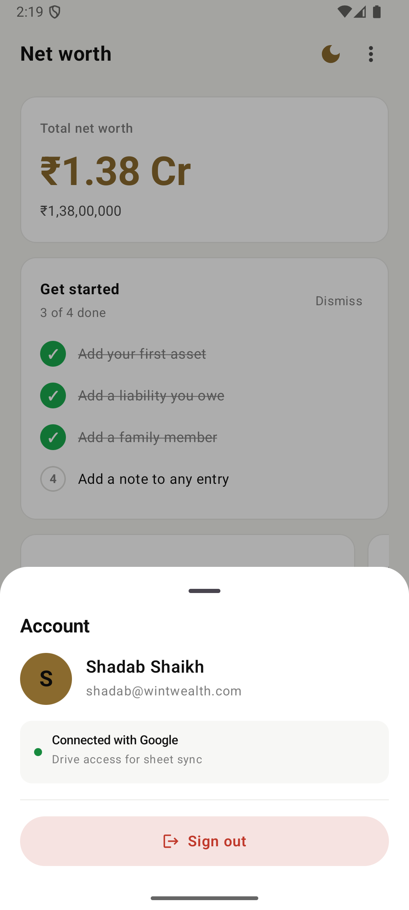
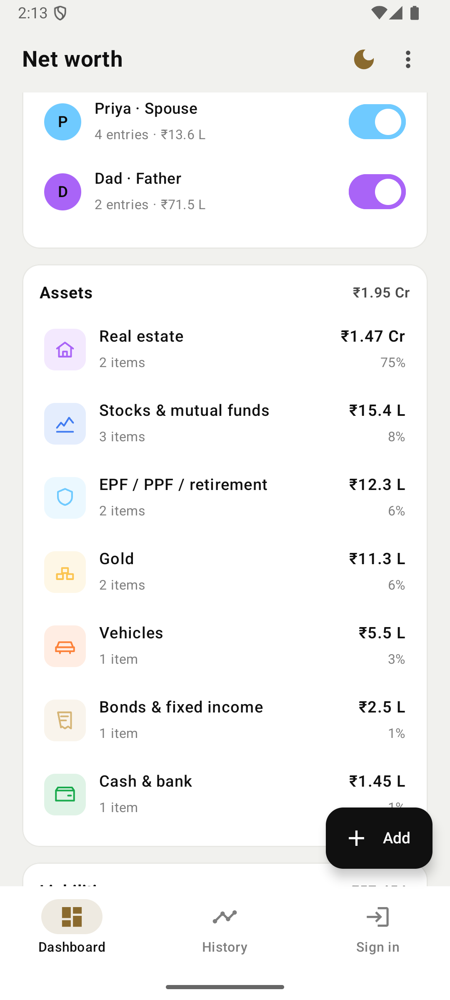

<div align="center">

# 💰 Net Worth Calculator — Android

**A native, offline-first personal net-worth tracker for India (₹), built with Kotlin & Jetpack Compose — with optional Google Sheets sync so your data lives in _your_ Drive and stays in step with the web app.**


</div>

---

## ✨ Overview

Track everything you **own** and everything you **owe**, across your whole household, and see your net worth come alive — allocation, liquidity, and month-over-month trend. It works **fully offline** on device, and when you sign in with Google it mirrors your data to a private spreadsheet in your own Drive (scope `drive.file` — the app can only touch the file it created). No backend, no analytics, no API keys.

<div align="center">



</div>

---

## 🚀 Features

- **Dashboard** — total net worth with a "since last month" delta, assets-vs-liabilities, an **asset-allocation donut**, liquid-vs-locked with emergency coverage, and a **net-worth trend** line.
- **Category drilldown** — per-item lists with hide/exclude-from-totals, edit, delete, notes & reference links, and owner badges.
- **Household members** — tag items to people; a per-member include/exclude toggle instantly recomputes every total.
- **Gold & silver by weight** — enter grams and price live from a per-gram rate.
- **Monthly history** — snapshots recorded automatically; trend chart + table (revealed once there are 2+ months).
- **Google Sheets sync** — sign in with Google and share one spreadsheet with the [web app](https://github.com/shadabshaikh0/networth-calculator); edits on either platform show up on the other.
- **Polish** — onboarding checklist, sample portfolio, CSV export & share, dark/light theme, animated charts, haptics, and an empty state.

<div align="center">




</div>

---

## 🛠️ Tech Stack

| Area | Choice |
|---|---|
| Language | **Kotlin** |
| UI | **Jetpack Compose** + **Material 3** (custom design-token theme, dark/light) |
| Architecture | **MVVM** — `AndroidViewModel` + `StateFlow`, unidirectional data flow |
| Persistence | **DataStore** (Preferences) + **kotlinx.serialization** (JSON) |
| Charts | **Custom `Canvas`** donut & trend — no third-party chart library |
| Auth | **Google Authorization API** (`play-services-auth`) → `drive.file` token |
| Cloud | **Drive + Sheets v4 REST** (via `HttpURLConnection`) |
| Money | Integer rupees (`Long`) with Indian digit grouping (lakh/crore) |
| Testing | **JUnit** on a pure, Android-free domain layer |

---

## 🧱 Architecture

Clean separation of layers — the money math is a **pure, fully-testable** module with zero Android dependencies.

```
app/src/main/java/com/shadabshaikh/networth/
├── model/         # immutable data classes (Item, Member, Snapshot, SnapshotData…)
├── data/          # Constants, LocalStore (DataStore)
│   ├── auth/      #   AuthManager — Google sign-in + drive.file token
│   └── sync/      #   SheetsApi + SheetsRepository — Drive/Sheets REST contract
├── domain/        # pure logic → unit-tested (Networth, Format, Derive, History, Csv)
└── ui/            # Compose: NetworthApp, NetworthViewModel
    ├── screens/   #   Dashboard, CategoryDrilldown, History
    ├── sheets/    #   AddEditItem, ManageMembers, Account (ModalBottomSheets)
    ├── components/#   DonutChart, TrendLineChart, AnimatedBar, CategoryIcon, Chip
    └── theme/     #   design tokens + type scale
```

**Data flow:** `UiState` (raw, immutable) → pure `derive()` → `Derived` (display-ready) → Compose. Events flow up through the `ViewModel`; the `ViewModel` is the single source of truth.

---

## ☁️ How the Google Sheets sync works

The app reuses the same **spreadsheet contract** as the web app, so both platforms interoperate on one file:

- **Find/create** — locates the sheet via a Drive `appProperties` marker (`networthApp=1`); creates `Net worth data` with tabs `Assets · Liabilities · Members · Meta` on first sign-in.
- **Read/write** — `values.batchGet` / `batchClear` + `batchUpdate` (RAW); items serialize to fixed columns, metals keep `grams`+`metal` so values reprice live, and `Meta` holds `included`/`rates`/`history` as JSON.
- **Reconcile** — on sign-in the existing sheet wins; otherwise local data is pushed (a fresh, untouched demo seed starts you on a clean sheet). Every change triggers a debounced (~1s) push.

Privacy: scope is limited to **`drive.file`**, so the app can only see the one spreadsheet it created — nothing else in your Drive.

---

## 🏃 Getting Started

### Prerequisites
- Android Studio (latest), JDK 17+
- An Android device or emulator on **API 33+** (a **Google Play** system image is required for Google sign-in)

### Build & run
```bash
git clone https://github.com/shadabshaikh0/Networth-Calculator-app.git
cd Networth-Calculator-app
./gradlew :app:assembleDebug        # build
./gradlew :app:testDebugUnitTest    # run unit tests
```
Or open the project in Android Studio and hit **Run ▶**. The app is fully usable offline — Google sync is optional.

### Enabling Google Sheets sync (optional)
1. In **Google Cloud Console** (a project with the **Drive** and **Sheets** APIs enabled), create an **OAuth client ID → Android**, using the app's package name `com.shadabshaikh.networth` and your signing **SHA-1** (`./gradlew :app:signingReport`).
2. On the **OAuth consent screen**, add your Google account under **Test users** (the `drive.file` scope is sensitive while the app is in testing).
3. Run on a device with a Google account, tap **Sign in** — a `Net worth data` sheet appears in your Drive.

---

## 🧪 Testing

The domain layer (`domain/`) is pure Kotlin and covered by JUnit tests that lock exact parity with the reference math — the seed portfolio's net worth (**₹1.38 Cr**) is the canonical fixture, alongside compact-formatting boundaries (L/Cr, negatives), gold-by-weight pricing, and monthly-history upserts.

```bash
./gradlew :app:testDebugUnitTest
```

---

## 🗺️ Roadmap

- Release signing, app icon & Play listing
- Sync conflict handling + offline retry queue and "last synced" timestamp
- Widgets / at-a-glance net-worth complication
- Biometric app lock

---

## 📄 License

Released under the **MIT License** — see [`LICENSE`](LICENSE).

<div align="center">
<sub>Built with Kotlin & Jetpack Compose.</sub>
</div>
